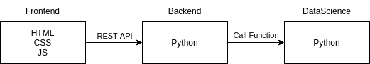

# fastapi-example
FastApi Example based on [https://fastapi.tiangolo.com/tutorial/](https://fastapi.tiangolo.com/tutorial/)


## Description
This project shows some basic functionality for backend / frontend interaction.



## Howto start

```bash
pip install fastapi
pip install uvicorn
```
```bash
uvicorn main:app --reload
```

After that you can access:

- [http://127.0.0.1:8000/](http://127.0.0.1:8000/)
- [http://127.0.0.1:8000/users](http://127.0.0.1:8000/users)
- [http://127.0.0.1:8000/docs](http://127.0.0.1:8000/docs)
- [http://127.0.0.1:8000/static/index.html](http://127.0.0.1:8000/static/index.html)
